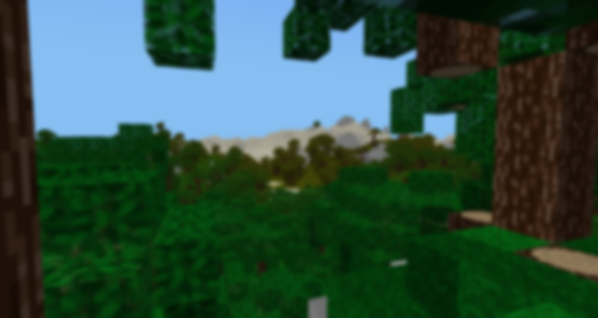

# 
A Minecraft clone written in Python; very creatively named because I couldn't think of anything better. Highly customisable (I think). Should run on Python 3.8+ and probably runs on 3.6+ (if not, I can try and patch the code that's causing the issue). Does *not* run on Python 3.5 or less because those versions lack format strings. To run, just run the file `run.pyw`.
### Required libraries to run:
- `pygame`
- `pyopengl`
- `numpy`
- `opensimplex`

The newest versions are recommended, but older versions should still work. 

## Gameplay
The world has a fixed (but configurable) size and is made of 15 types of blocks. Terrain is procedurally generated.
- `WSAD` movement
- `Mouse` camera control
- `Left Click` destroy block
- `Right Click` place block
- `Middle Click` pick block
- `F` toggle flying
- `M` information menu
- `R` run python code
- `C` clear textbox
- `^ v Arrow Keys` change block
- `F1` hide GUI
- `F2` take screenshot

The game has a primitive physics engine that models player movement/gravity as acceleration, which then gets translated into actual movement. The game accurately calculates block collisions by calculating the blocks that the player hitbox collides with from the hitbox of the player itself, and then breaks player movement into steps smaller than 1 length unit and calculates collisions separately in each such step. The physics engine gets called once every tick, with player movement linearly interpolated by the main game loop inbetween ticks.
The game culls chunks it does not need to render. However, this only gets updated once the player moves from one chunk to another or changes his rotation. This increases performance (which is important, especially on low end machines and especially because this thing is written in Python ffs.) but comes at the cost of occasional rendering artefacts (missing chunks etc). I will try and find a solution to this that I would find satisfactory, but for now, this is how it is.

## Structure
- `run.pyw` is a wrapper that allows the game to run without a console window on MS Windows and handles exceptions/crashes.
- `game.py` contains the main game loop, meaning: loading all the game's components, non-movement related controls, management of rendering and tick update times aswell as switching between menu and gameplay mode.
- `init.py` is the most important file in the game. It initialises graphics and contains all the helper functions that the game uses to do basically anything.
- `render_blocks.py` contains most of the rendering code.
- `terragen.py` contains most of the terrain generation code.
- `menu.py` contains the code that runs the main menu.
- `settings.py` contains all the game's settings and is meant to be edited.
